# 🎬 Netflix Clone - Full Stack Application

A production-ready Netflix clone featuring a modern React/TypeScript frontend with comprehensive DevOps infrastructure including Docker, Kubernetes, Jenkins CI/CD, and Terraform IaC.

<div align="center">
  
  [](https://react.dev/)
  [](https://www.typescriptlang.org/)
  [](https://mui.com/)
  [](https://vitejs.dev/)
  [](#license)

</div>

---
#### Architecture Diagram

*System Architecture Overview*
---

## 📋 Table of Contents

- [Overview](#overview)
- [Features](#features)
- [Tech Stack](#tech-stack)
- [Architecture](#architecture)
- [Project Structure](#project-structure)
- [Installation & Setup](#installation--setup)
- [Environment Variables](#environment-variables)
- [Running the Application](#running-the-application)
- [Docker Deployment](#docker-deployment)
- [Kubernetes Deployment](#kubernetes-deployment)
- [CI/CD Pipeline](#cicd-pipeline)
- [Infrastructure as Code](#infrastructure-as-code)
- [Deployment Dashboard](#deployment-dashboard)
- [API Integration](#api-integration)
- [Key Components](#key-components)
- [Contributing](#contributing)
- [License](#license)

---

## 🎯 Overview

This is a full-stack Netflix clone application that demonstrates modern web development practices with enterprise-grade DevOps infrastructure. The application fetches real movie and TV show data from The Movie Database (TMDB) API and provides a Netflix-like user interface with advanced features like infinite scrolling, video playback, genre filtering, and more.


---

## ✨ Features

### Frontend Features
- **Home Page** - Dynamic hero section with trending content and genre-based content sliders
- **Infinite Scrolling** - Lazy load content for better performance
- **Genre Exploration** - Browse content by genres with dedicated genre pages
- **Detail Modal** - Rich modal displaying comprehensive information about movies/shows
- **Video Player** - Custom video.js player with YouTube support
- **Search Functionality** - Search movies and TV shows across the catalog
- **Mini Portal** - Quick preview of content on hover
- **Responsive Design** - Mobile, tablet, and desktop support
- **Dark Theme** - Netflix-inspired dark theme
- **Smooth Animations** - Framer Motion powered animations and transitions

### Backend & Infrastructure Features
- **RESTful API Integration** - TMDB API integration for real movie data
- **State Management** - Redux Toolkit for global state management
- **Type Safety** - Full TypeScript implementation
- **Docker Containerization** - Multi-stage Docker build
- **Kubernetes Orchestration** - K8s deployment with auto-scaling
- **CI/CD Pipeline** - Jenkins automation with quality gates
- **Infrastructure as Code** - Terraform for AWS infrastructure
- **Monitoring & Logging** - Prometheus, Grafana, and monitoring dashboards

---

## 🛠 Tech Stack

### Frontend
| Technology | Purpose |
|-----------|---------|
| **React 18.2** | UI library |
| **TypeScript 4.6** | Type safety |
| **Vite 3.2** | Build tool & dev server |
| **Material-UI (MUI) 5.10** | Component library |
| **Redux Toolkit 1.8** | State management |
| **React Router 6.9** | Routing |
| **Framer Motion 7.1** | Animations |
| **video.js 8.3** | Video player |
| **React Slick 0.29** | Carousel slider |

### DevOps & Infrastructure
| Technology | Purpose |
|-----------|---------|
| **Docker** | Containerization |
| **Kubernetes** | Orchestration |
| **Jenkins** | CI/CD Pipeline |
| **Terraform** | Infrastructure as Code |
| **AWS** | Cloud Provider (EC2, ECS, VPC) |
| **Prometheus** | Metrics collection |
| **Grafana** | Monitoring dashboards |
| **SonarQube** | Code quality analysis |

---

## 🏗 Architecture

```
┌─────────────────────────────────────────────────────────────┐
│                     Frontend Application                     │
│         (React + TypeScript + Material-UI + Redux)          │
│                   Deployed on Vercel / K8s                  │
└────────────────────────┬────────────────────────────────────┘
                         │
                         ↓ (HTTPS)
                    ┌──────────┐
                    │ TMDB API │
                    └──────────┘
                         ↑
                         │
            ┌────────────────────────┐
            │  Netflix Clone Backend  │
            │  (Kubernetes Cluster)   │
            │                        │
            │  ┌──────────────────┐  │
            │  │   Pod 1 (App)    │  │
            │  └──────────────────┘  │
            │  ┌──────────────────┐  │
            │  │   Pod 2 (App)    │  │
            │  └──────────────────┘  │
            │  ┌──────────────────┐  │
            │  │  Load Balancer   │  │
            │  └──────────────────┘  │
            └────────────────────────┘
                         │
        ┌────────────────┼────────────────┐
        ↓                ↓                ↓
   ┌─────────┐    ┌──────────┐    ┌──────────┐
   │ Jenkins │    │ SonarQube│    │Prometheus│
   │ (CI/CD) │    │  (QA)    │    │(Metrics) │
   └─────────┘    └──────────┘    └──────────┘
        │                              │
        └──────────────┬───────────────┘
                       ↓
            ┌──────────────────────┐
            │  AWS Infrastructure   │
            │  (Terraform Managed)  │
            │                      │
            │  VPC, EC2, IAM, etc  │
            └──────────────────────┘
```

---

## 📁 Project Structure

```
Netflix Clone/
├── Application-Code/                 # Frontend Application
│   ├── src/
│   │   ├── components/              # Reusable React components
│   │   │   ├── animate/            # Animation-related components
│   │   │   ├── layouts/            # Layout components
│   │   │   ├── slick-slider/       # Carousel components
│   │   │   └── watch/              # Video player components
│   │   ├── pages/                  # Page components
│   │   │   ├── HomePage.tsx        # Main browse page
│   │   │   ├── GenreExplore.tsx    # Genre-specific pages
│   │   │   └── WatchPage.tsx       # Video watch page
│   │   ├── store/                  # Redux store & slices
│   │   │   ├── slices/
│   │   │   │   ├── apiSlice.ts    # TMDB API endpoints
│   │   │   │   ├── genre.ts       # Genre data
│   │   │   │   └── discover.ts    # Discovery state
│   │   │   └── index.ts           # Store configuration
│   │   ├── hooks/                 # Custom React hooks
│   │   ├── utils/                 # Utility functions
│   │   ├── types/                 # TypeScript types
│   │   ├── theme/                 # MUI theme configuration
│   │   ├── providers/             # Context providers
│   │   ├── routes/                # Route configuration
│   │   └── main.tsx               # Application entry point
│   ├── public/                     # Static assets
│   ├── Dockerfile                  # Multi-stage Docker build
│   ├── package.json               # Dependencies
│   ├── vite.config.ts             # Vite configuration
│   ├── tsconfig.json              # TypeScript configuration
│   └── vercel.json                # Vercel deployment config
│
├── Kubernetes/                     # K8s manifests
│   ├── deployment.yml             # K8s deployment spec
│   └── service.yml                # K8s service spec
│
├── Terraform/                      # Infrastructure as Code
│   ├── main.tf                    # Main AWS resources
│   ├── variables.tf               # Variable definitions
│   ├── vpc.tf                     # VPC & networking
│   ├── iam.tf                     # IAM roles & policies
│   ├── backend.tf                 # S3 backend config
│   └── dev.auto.tfvars            # Development variables
│
├── Jenkins/                        # CI/CD Pipeline
│   └── Jenkinsfile                # Pipeline configuration
│
└── README.md                       # Project documentation
```

---

## 🚀 Installation & Setup

### Prerequisites

- **Node.js** 18.0 or higher
- **npm** or **yarn** package manager
- **TMDB API Key** (free account at [themoviedb.org](https://www.themoviedb.org/))
- **Docker** (for containerization)
- **kubectl** (for Kubernetes)
- **Terraform** (for infrastructure)

### Step 1: Clone the Repository

```bash
git clone https://github.com/ShahidKhan232/Netflix-clone-k8s-end-to-end.git
cd "Netflix clone"
```

### Step 2: Navigate to Application Code

```bash
cd Application-Code
```

### Step 3: Install Dependencies

```bash
npm install
# or
yarn install
```

### Step 4: Get TMDB API Key

1. Visit [themoviedb.org](https://www.themoviedb.org/)
2. Create a free account
3. Go to Settings → API → Get your API Key
4. Create a `.env.local` file in `Application-Code/` directory

### Step 5: Configure Environment Variables

```bash
# .env.local
VITE_APP_TMDB_V3_API_KEY=your_api_key_here
VITE_APP_API_ENDPOINT_URL=https://api.themoviedb.org/3
```

---

## 🌍 Environment Variables

Create a `.env.local` file in the `Application-Code` directory:

```env
# TMDB API Configuration
VITE_APP_TMDB_V3_API_KEY=<your_tmdb_api_key>
VITE_APP_API_ENDPOINT_URL=https://api.themoviedb.org/3

# Optional: Application Configuration
VITE_APP_NODE_ENV=development
VITE_APP_LOG_LEVEL=debug
```

---

## 💻 Running the Application

### Development Server

```bash
npm run dev
# or
yarn dev
```

The application will start at `http://localhost:5173`

### Build for Production

```bash
npm run build
# or
yarn build
```

### Preview Production Build

```bash
npm run preview
# or
yarn preview
```

---

## 🐳 Docker Deployment

### Build Docker Image

The project uses a multi-stage Docker build for optimized production images:

```bash
# Navigate to Application-Code directory
cd Application-Code

# Build image with API key as build argument
docker build \
  --build-arg TMDB_V3_API_KEY=your_api_key_here \
  -t netflix-clone:latest .
```

### Run Docker Container

```bash
docker run -d \
  -p 80:80 \
  --name netflix-app \
  netflix-clone:latest
```

Visit `http://localhost` to view the application.

### Dockerfile Stages

**Stage 1: Builder**
- Node 20 Alpine base
- Installs dependencies
- Builds optimized production bundle
- Sets environment variables

**Stage 2: Production**
- Nginx Alpine base
- Serves static files
- Minimal final image size

---

## ☸️ Kubernetes Deployment

### Prerequisites

- Kubernetes cluster (EKS, GKE, or local minikube)
- kubectl configured
- Docker image pushed to registry

### Deploy to Kubernetes

```bash
cd Kubernetes

# Apply deployment manifest
kubectl apply -f deployment.yml

# Apply service manifest
kubectl apply -f service.yml

# Verify deployment
kubectl get deployments
kubectl get pods
kubectl get services
```

### Deployment Configuration

**Replicas**: 2 (auto-scaling configured)
**Image**: `avian19/netflix:latest`
**Port**: 80
**Resources**: Auto-managed by cluster

### Check Deployment Status

```bash
# Get pods
kubectl get pods -l app=netflix-app

# View logs
kubectl logs -f deployment/netflix-app

# Port forward for local testing
kubectl port-forward svc/netflix-app 8080:80
```

---

## 🔄 CI/CD Pipeline

### Jenkins Pipeline Stages

```
1. Workspace Cleanup
   ↓
2. Checkout Code (from GitHub)
   ↓
3. Install Dependencies
   ↓
4. SonarQube Analysis (Code Quality)
   ↓
5. Build Application
   ↓
6. Build Docker Image
   ↓
7. Push to Docker Registry
   ↓
8. Deploy to Kubernetes
   ↓
9. Health Checks & Notifications
```

### Jenkinsfile Configuration

- **SCM Integration**: GitHub
- **SonarQube Analysis**: Automated code quality checks
- **Docker Registry**: DockerHub (shahidkhan232/netflix)
- **Image Tagging**: Build number-based tags
- **K8s Deployment**: Automated rollout

### Running Jenkins Pipeline

1. Configure Jenkins with GitHub webhook
2. Create new pipeline job
3. Point to `Jenkins/Jenkinsfile`
4. Trigger on push to main branch
5. Monitor build progress in Jenkins console

---

## 🏗 Infrastructure as Code

### Terraform Structure

**AWS Resources Managed**:
- **VPC**: Custom virtual network with subnets
- **EC2**: Compute instances for K8s nodes
- **IAM**: Roles, policies, and security
- **ECS/EKS**: Container orchestration
- **RDS** (optional): Database infrastructure
- **Load Balancer**: Traffic distribution

### Deploy Infrastructure

```bash
cd Terraform

# Initialize Terraform
terraform init -backend-config="bucket=your-s3-bucket" \
               -backend-config="key=netflix/terraform.tfstate" \
               -backend-config="region=us-east-1"

# Review infrastructure plan
terraform plan -out=tfplan

# Apply infrastructure changes
terraform apply tfplan

# Destroy infrastructure (when needed)
terraform destroy
```

### Key Terraform Files

- **main.tf**: Primary AWS resources
- **vpc.tf**: VPC, subnets, gateways
- **iam.tf**: IAM roles and policies
- **variables.tf**: Input variables
- **dev.auto.tfvars**: Development environment variables
- **backend.tf**: Remote state configuration

---

## 📊 Deployment Dashboard

The project integrates comprehensive monitoring and visualization:

### Screenshots of Infrastructure

<div align="center">


#### Jenkins Pipeline Dashboard
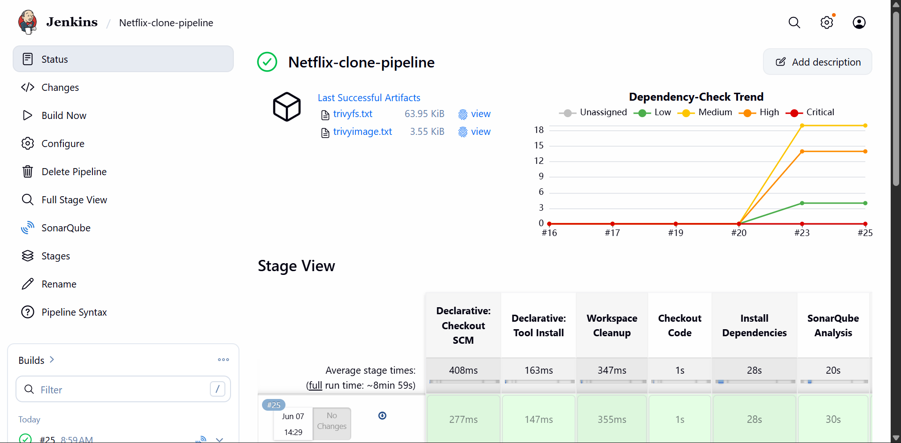
*CI/CD Pipeline Automation*

#### Jenkins Build Details
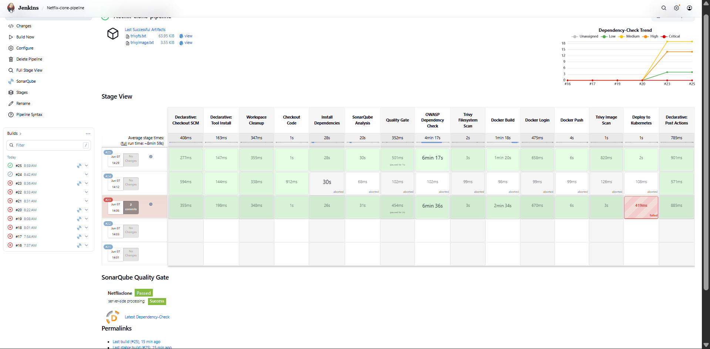
*Build Execution Details*

#### Jenkins Server Dashboard
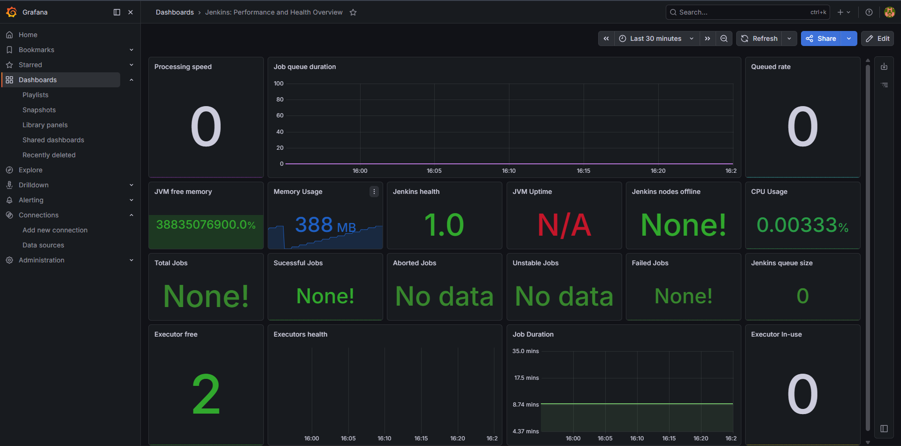
*Jenkins Server Metrics*

---

#### Prometheus Metrics
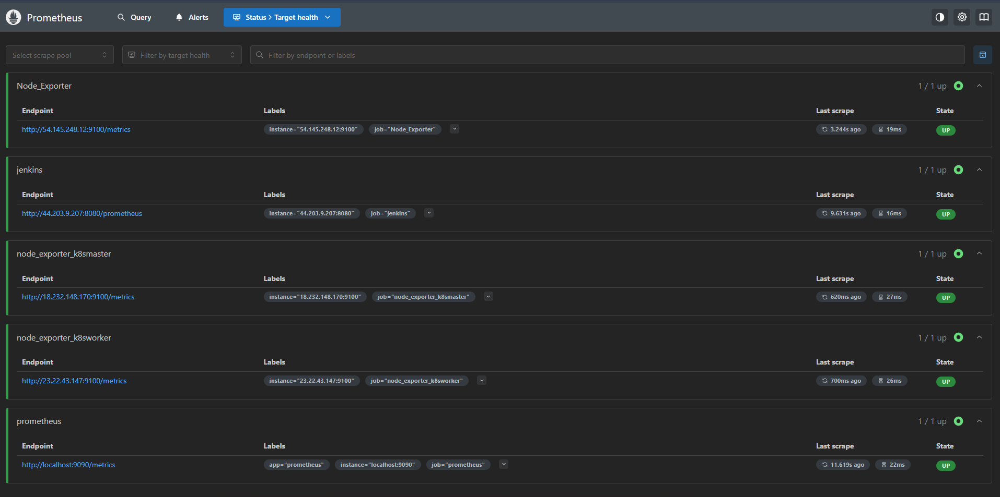
*Application Metrics Collection*

#### Grafana Monitoring Dashboard
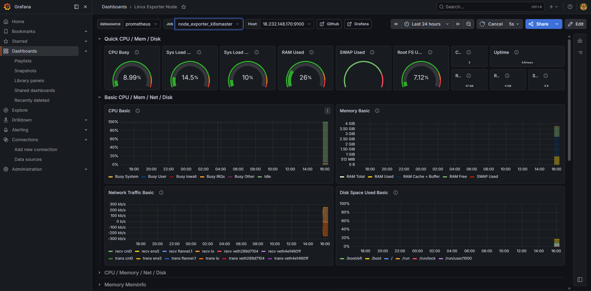
*Master Node Metrics*

#### Node Exporter Dashboard
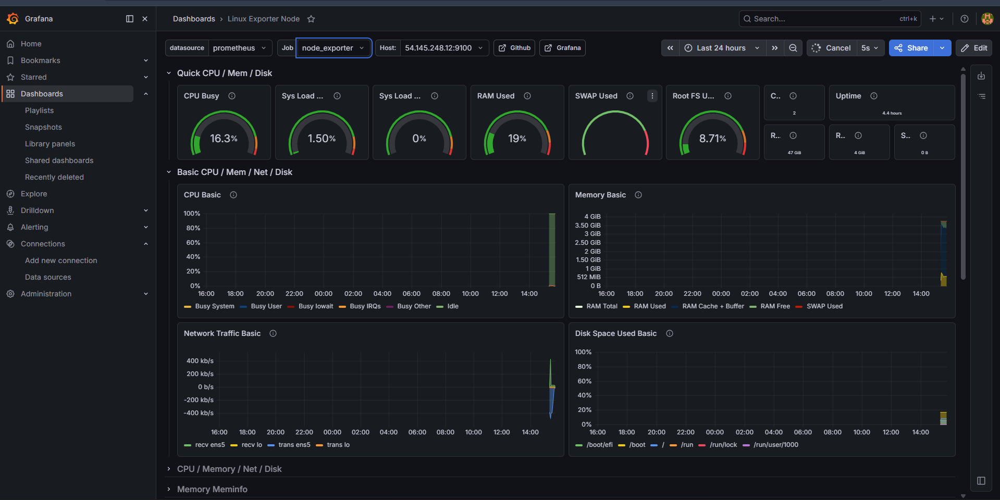
*System-level Metrics*

#### Worker Server Dashboard
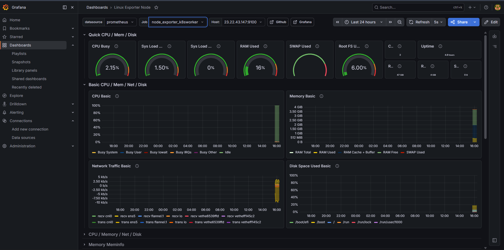
*Worker Node Metrics*

---

#### EC2 Instances
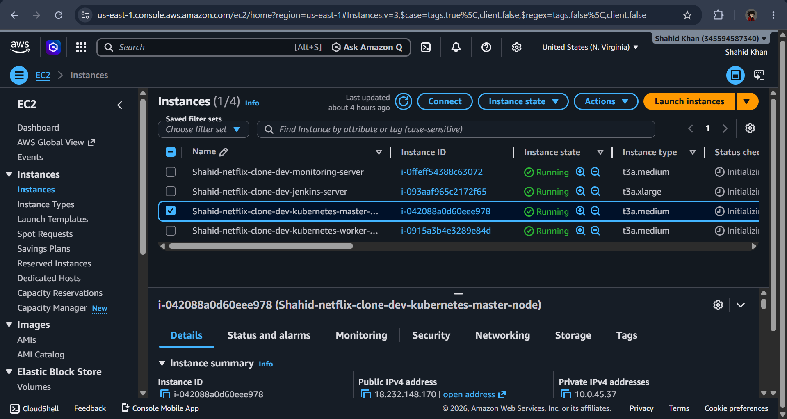
*AWS EC2 Instance Configuration*

#### Terraform GitHub Integration
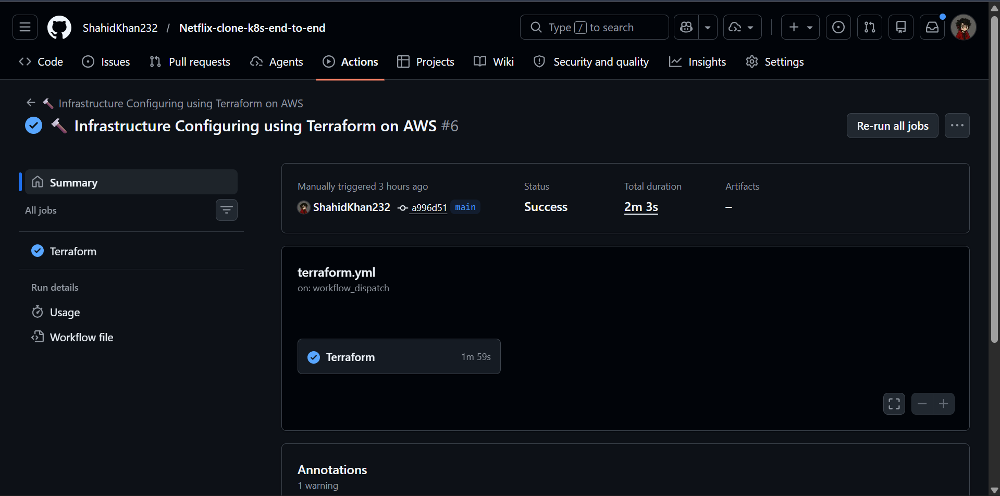
*Infrastructure Code Repository*

---

#### Slack Notifications
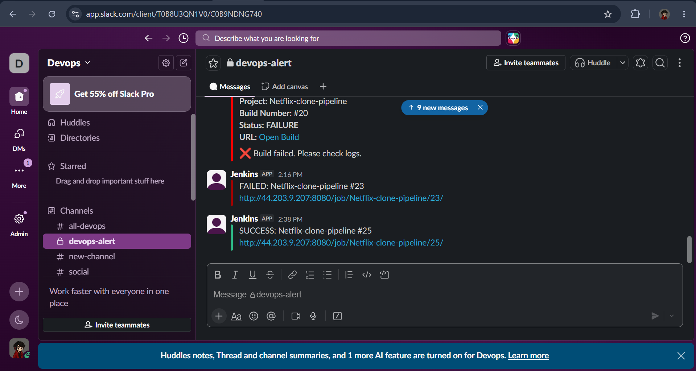
*CI/CD Pipeline Notifications*

#### SonarQube Analysis
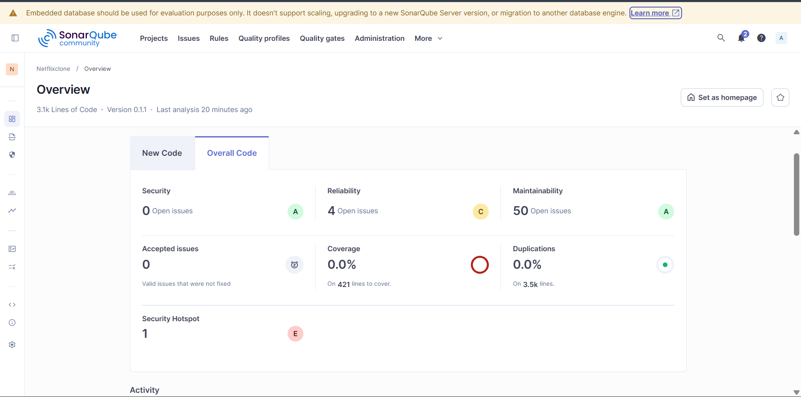
*Code Quality Analysis Results*

#### Dependency Check
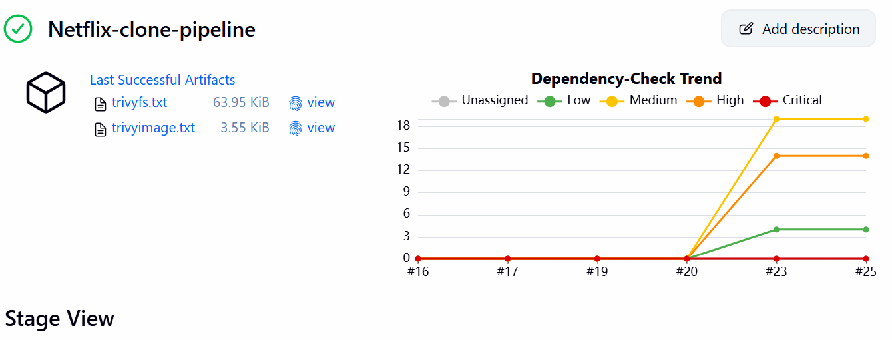
*Security Vulnerability Scanning*

#### Build Output
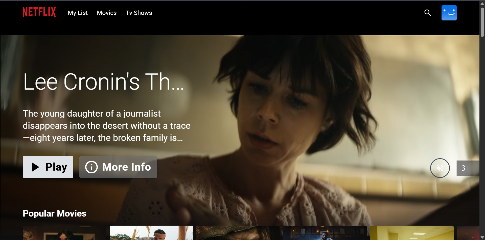
*Build Compilation Output*

</div>

---

## 📡 API Integration

### TMDB API Integration

The application uses Redux Toolkit Query for efficient API management:

**Base Endpoint**: `https://api.themoviedb.org/3`

**Key Endpoints Used**:
- `GET /configuration` - App configuration
- `GET /discover/movie` - Discover movies
- `GET /discover/tv` - Discover TV shows
- `GET /genre/movie/list` - Movie genres
- `GET /genre/tv/list` - TV genres
- `GET /movie/{id}` - Movie details
- `GET /tv/{id}` - TV show details
- `GET /search/multi` - Multi-content search

**Features**:
- RTK Query for automatic caching and synchronization
- Pagination support with limit and offset
- Real-time data fetching
- Error handling and retry logic

---

## 🧩 Key Components

### Layout Components
- **MainLayout** - Main application wrapper with header and footer
- **MainHeader** - Navigation header with logo and links
- **Footer** - Application footer

### Content Components
- **HeroSection** - Hero banner with featured content
- **VideoSlider** - Carousel for content rows
- **VideoItemWithHover** - Card with hover effects
- **SimilarVideoCard** - Related content cards

### Modal & Interaction
- **DetailModal** - Rich content information modal
- **SearchBox** - Search functionality
- **VideoPortalContainer** - Portal for video playback

### Video Player
- **VideoJSPlayer** - Custom video.js wrapper
- **PlayerControlButton** - Custom player controls
- **PlayerSeekbar** - Custom seekbar
- **VolumeControllers** - Volume control UI

### Utilities
- **Custom Hooks**: useWindowSize, useIntersectionObserver, useOffSetTop
- **Redux Hooks**: useAppDispatch, useAppSelector
- **Context API**: DetailModalProvider, PortalProvider

---

## 🎨 UI/UX Features

- **Responsive Design**: Mobile-first approach
- **Dark Theme**: Netflix-inspired dark color scheme
- **Smooth Animations**: Framer Motion animations
- **Loading States**: Custom loading screens
- **Error Boundaries**: Graceful error handling
- **Accessibility**: ARIA labels and semantic HTML
- **Performance**: Code splitting and lazy loading

---

## 📈 Performance Optimizations

- **Vite Build Tool**: Fast build times and optimized output
- **Code Splitting**: Lazy route loading
- **Image Optimization**: Next-gen image formats
- **CSS-in-JS**: Emotion styling for optimized CSS
- **Redux Normalization**: Efficient state management
- **Infinite Scroll**: Reduces initial page load
- **Caching**: RTK Query automatic caching

---

## 🔒 Security

- **Environment Variables**: Sensitive data in .env
- **HTTPS**: All API calls over HTTPS
- **CORS**: Configured for TMDB API
- **Input Validation**: User input sanitization
- **Dependencies**: Regular security updates
- **IAM Roles**: AWS least privilege access
- **RBAC**: Kubernetes role-based access control

---

## 🤝 Contributing

Contributions are welcome! Please follow these steps:

1. Fork the repository
2. Create a feature branch (`git checkout -b feature/AmazingFeature`)
3. Commit changes (`git commit -m 'Add AmazingFeature'`)
4. Push to branch (`git push origin feature/AmazingFeature`)
5. Open a Pull Request

### Code Quality
- Run ESLint: `npm run lint`
- Format code: `npm run format`
- Type check: `tsc --noEmit`

---

## 📄 License

This project is licensed under the MIT License - see the LICENSE file for details.

---

## 🙏 Acknowledgments

- **TMDB API** - For providing movie and TV data
- **Material-UI** - For component library
- **Redux Toolkit** - For state management
- **Framer Motion** - For animations
- **Kubernetes** - For orchestration
- **Netflix** - For UI/UX inspiration

---

## 📞 Contact & Support

- **GitHub**: [ShahidKhan232](https://github.com/ShahidKhan232)
- **Repository**: [Netflix-clone-k8s-end-to-end](https://github.com/ShahidKhan232/Netflix-clone-k8s-end-to-end)
- **Issues**: [Report a bug](https://github.com/ShahidKhan232/Netflix-clone-k8s-end-to-end/issues)

---

<div align="center">

**⭐ If you found this project helpful, please consider giving it a star! ⭐**

Made with ❤️ by [Shahid Khan](https://github.com/ShahidKhan232)

</div>
